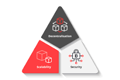

# Addresses

Верифицирането на транзакциите става чрез математика вместо чрез central authorities.

- asymmetric cryptography and digital signatures(криптиране с частен ключ, подписване)

* [Elliptic Curve Cryptography](https://medium.com/coinmonks/introduction-to-blockchains-bedrock-the-elliptic-curve-secp256k1-e4bd3bc17d)

  - подобно на RSA, но ползва elliptic крива над крайни полета, по-кратки ключове

* операцията по генериране на публичен от частен ключ е необратима

## Public/Private key addresses (creation)

- **a cryptographically secured source of entropy** $\to$ **private key** $\to$ **elliptic curve multiplication** $\to$ **public key** $\to$ **hashing encoding; trimming** $\to$ **address**

- **портфейл** vs **акаунт** vs **адрес**
- частният ключ се държи в портфейла, това е основният смисъл на портфейла

- **tx** object
- получателят трябва да докаже, че той е собственикът на адреса, посочен в транзакцията
  - проверка с private ключ подписване

**_Bitcoin -> UTXO_**  
**_Ethereum -> Account balance model_**

- пак имаме адрес и свойства, които го правят акаунт,
- разликата е, че имаме едно число за баланс

❗ How are addresses added to the protocol -- не се добавят, те са числа, протокола не го интересува, стига да са валидни, приемат се  
❗ Можем да пратим транзакция на адрес, който не съществува, транзакцията е валидна; при положение, че се появи такъв адрес, ще получи ресурса

- Транзакциите са повече като udp, отколото като tcp, няма handshake

## Типове акаунти в Ethereum

#### Externally Owned Account(външни акаунти, човешки акаунти)

Външен за самата мрежа, генериран от частен ключ. В Ethereum към този момент само този тип може да инициират транзакции.  
Всяко update-ване на ledger-а се случва от такъв акаунт.

- акаунт, който се контролира от частен ключ

* може да инициира транзакции
* транзакции между EOAs могат да бъдат eth/token транзакции
* няма такси за създаване, не струват нищо

* Създава се като генерираме частен ключ

$Address(Key_{pb}) = Bits_{96..255}(Keccak(ECDSA(Key_{pr})))$

1. Randomly create a $Key_{pr}$ - 32 bytes, hex-encoded 64 characters
2. Perform ECDSA(elliptic curve digital signature algorithm)(using ECM) on the **secp256k1** elliptic curve $Key_{pr}$ times $\to$ results in a $Key_{pb}$ - 64 bytes, hex encoded 128 characters
3. Hash the $Key_{pb}$ using keccak256 $\to$ results in 64 characters, 32 bytes hash code
4. Take the last 20 bytes of the hash code $\to$ results in an address(account) - 40 character, 20 bytes
5. Put **Ox** prefix in front of the address for readability

- Хората се идентифицират с 20 байта в Ethereum.

#### Contract Account

(междинни връзки, не могат да бъдат в краищата)

- няма частен ключ, контролира се от код(smart contract)
  - не може да подписва и съотв. не може да инициира транзакции
- може само да праща транзакции като отговор към получаването на транзакция
- транзакциите от EOA към CA могат да задействат код, който прави много действия, включително създаването на нов контракт

* получаваме адреса като функция на externally owned account, няма ентропия, не ни и трябва

$Address_{contr}(Address_{sender}, Nonce_{sender}) = Bits_{96..255}(keccak256(RLPEncode([Address_{sender}, Nonce_{sender}])))$

- sender -- този, който деплойва

1. Take (externally owned account) $Address_{sender}$ that deploys the contract
2. Take that Address's $Nonce_{sender}$
3. Encode in RLP(recursive length prefix) both fields as an array $[Address_{sender}, Nonce_{sender}]$
4. Hash the serialized result with keccak256
5. Take tha last 20 bytes of the hash
6. Put **Ox** prefix for readability

- на smart контракта не му трябва частен ключ

Понеже това е детерминистичен процес, можем да определим как nonce ще се увеличи, можем да пратим крипто на следващите адреси.

- противникът ни разчита, че баланса в началото е 0
- добрата практика е, че ако ще деплойваме нов smart контракт, е да го деплойваме от чисто нов адрес

---

`Side note`

- helium мрежа - 3 в 1 консенсусен механизъм

* helium map

- [Update on the helium networks migration to solana](https://blog.helium.com/an-update-on-the-helium-networks-migration-to-solana-4550e20552a9)

- proof of position -- първоначален вариант на консенсус на helium

---

`Side note` P2PKH format

транзакция, в която има smart contract -- internal transaction

- за различните протоколи има различни начини за осигуряването на ентропията

---

## Wallets

- interface that allows you to interact with the blockchain
- it holds the ownership to the cryptocurrency balance of the account
- similar to keyring
- holds the account's private key
- can hold multiple private keys

#### Hot wallets

- свързани с интернет

* не е сигурен вариант
* най-удобни

#### Cold wallets

- начин на съхранение на частния ключ, който не е свързан с интернет

* по-сигурен вариант
* пазене на 3 копия на частния ключ за сигурност

##### Types of wallets according to structure

- При детерминистичините портфейли всички адреси са генерирани от master private key.

* **non-deterministic wallets**
  - с един частен ключ, един публичен ключ и един адрес
  - в историята са, надградени са
  - ако човек иска още адреси, трябва да се направи нов wallet, което не е желано
* **sequential deterministic wallets**(детерминистичен процес, от частния ключ можем да генерираме всички адреси)

  - hash(private_key + number1) $\to$ public key 1
  - hash(private_key + number2) $\to$ public key 2
  - ...

  $|\text{public keys set}| = |\mathbb{N}|$

  - metamask e sequential; числа, които се добавят до seed-а, за да се получи нов частен ключ

* **hierarchical deterministic wallets**(BIP32) - използваме частен ключ, който се конвертира до seed

## Mnemonic

- series of 12/24 words used to create a private key, used to import your account in another wallet
  - need to be kept a secret(like a private key)

* BIP39 standard

### Generating mnemonic

1. Generate 128/256 bits of(crytographically secured source of) entropy
2. Hash with SHA256 and take first 4/8 bits(checksum)
3. Attach the checksum at the end of the entropy(step 1)
4. Group the resulting data by 11-bit groups
5. Each word corresponds to a word form a special dictionary
6. The of words(order is important) is the mnemonic code
7. Input the mnemonic and a passphrase(or salt - optional) into a key-stretching function
8. The key-stretching(PBKDF2) function hashes the input 2048 times using HMAC-SHA512 and generates a 512 seed code.
9. The seed is hashed again. The resulting 512-bit hash is divided into 2 equal 256 parts
10. The left 256 group becomes the Private Key(Master Private Key)
11. Use ECM(elliptic curve multiplication) to generate the Public key from the Private Key, just as usual

Използваме дясната част за генериране на публичен ключ, получаваме йерархия от ключове...

confirmation

`Side note` BIP - Bitcoin Improvement Proposal

❗❗❗ Тестови ethereums
