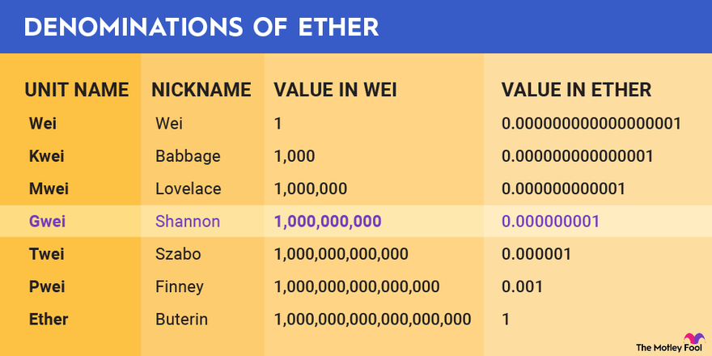

# Въпроси и бележки

- **_Деноминации на Ether_**

## Ethereum gas and Smart Contracts

- What is Ethereum Gas?  
  Ethereum **gas** е мерна единица за работа от изчислителна гледна точка, т.е. се базира на брой операции. Всяка операция принадлежи на даден клас операции {zero, jumpdest, base, verylow, low и т.н.}, като за всеки клас има определено количество **gas**, което е необходимо за извършването на такава операция.

- Защо четенето на данни е безплатно?  
  Защото всеки си има копие на данните, тъй като ledger-а е дистрибутиран.

- Кога се използва Ethereum Gas?  
  При **обработка** и **добaвяне** на данни към blockchain-a.

- Какво се случва, когато участник заяви твърде малко количество gas за извършване на заявката му?  
  Транзакцията се revert-ва и парите за газта се губят, т.е. пак плаща, независимо че кодът не е завършил.

- Какво се случва, когато газта е достатъчна?  
  Транзакцията обикновено минава успешно, стига да бъде валидна, и ако има остатък, то той се връща.

- Как валидаторите избират транзакция за валидиране и съответно добавяне към блок от memory pool-а с чакащи транзакции?  
  Те не следват FIFO стратегия, а избират най-доходоносните за тях транзакции, т.е. тези с най-големи такси.

- Как и защо така се пресмятат miner fees?  
  **miner fees = gas used $\cdot$ gas price**  
  И двата параметъра са динамични.  
  В gas price се отразява влиянето на пазара, търсенето и предлагането.  
  С Gas used промени можем да осигурим баланс и защита срещу флуктуациите в Ether цената.  
  ?При малките промени влияем върху gas price.

- GAS system keypoints:

  1. разделя ether и gas
  2. защитава от флуктуациите на цената на ether
  3. не позволява злонамерено пренатоварване на мрежата -- може да свърши газта и така транзакцията да преустанови; изобщо е икономически неизгодно провеждането на такива атаки

- Какво е Smart Contract?

  - самоизпълняващ се компютърен код, написан на Turing Complete език, който се изпълнява в блокчейн среда
  - изпълнява бизнес логика, т.е. програма и изразява блокчейн транзакции
  - Програмният език е **Turing Complete**, което означава, че за всеки изчислим проблем може да напишем програма на него, която го решава(при условията за неограничена памет и време...)

- Какви са основните характеристики на Smart Contracts?

  - автономност, самоизпълняват се
  - прозрачност, публичен ledger
  - cost savings(no intermediaries)
  - backup(много копия на ledger-a)

- Защо при Bitcoin няма метрика като GAS?  
  GAS като мерна единица се появява при smart contracts. При Bitcoin единственият тип транзакции, които можем да изпращаме са тези в класическия смисъл -- превод на актив, в случая Bitcoin. Тъй като чрез smart contracts можем да изпълняваме по-сложна и разнообразна бизнес логика, сложността на програмите, т.е. транзакциите вече не е константна и съответно GAS е мерната единица за това.
