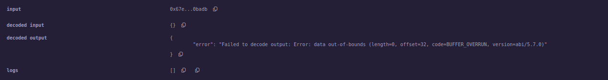

# Forced money, ABI, Blockchain governance & more

## `selfdestruct()`

- вкарване на крипто в smart contract, независимо че няма `payable` функции

* В момента, в който деплойнем СК на мрежа, понеже всички записи са immutable, не можем да го манипулираме

* **_Можем обаче да го блокираме със `selfdestruct` примитива_**

  - За да не остане ресурсът блокиран, можем да посочим адрес, на който да се изпрати останалият ресурс, независимо дали има `payable` функции

---

`Side note` **proxy smart contract**;

- дърпане на killswitch-a на СК,
  - update-ваме СК, прокси, което сочи към правилния СК; set-ваме properties, които пазят адреса на релеватния СК

---

```solidity

// SPDX-License-Identifier: GPL-3.0

pragma solidity >=0.5.0 <0.9.0;


contract A {
    uint256 number = 10;

    function getNum() public view returns(uint256) {
        return number;
    }

    function destroySC(address payable _addr) public {
        selfdestruct(_addr);
    }

    function getBalance() public view returns(uint256) {
        return address(this).balance;
    }

    function receive() external payable { }
    function fallback() external payable { }

}

contract B {

    function getBalance() public view returns(uint256) {
        return address(this).balance;
    }
}
```

Ако се опитаме да достъпим property на унищожен СК, би трябвало да получим грешка:



- `oracle` е вид СК, който може да изпълни транзакция извън ledger-а
  - _Oracles are data feeds that make off-chain data sources available to the blockchain for smart contracts_

## ABI

- използва се, за да си взаимодействаме със СК, предоставя интерфейс към функциите, които ни интересуват

* указва как виртуалната машина да интерпретира резултатите от извикване на функция, те са bytecodе
* compile time creation, важи и за байткода

- има значение дали един смарт контракт се вика вътре в ledger-а или се вика отвън

```
ledger world
A -> B // само подписване, заявката не напуска ledger-а

```

отвън $\to$ ledger world - трябва ни ABI, за да укажем как да се осъществи комуникацията

### Пример

```
[
	...
	{ // една функция
		"inputs": [],
		"name": "getBalance",
		"outputs": [
			{
				"internalType": "uint256",
				"name": "",
				"type": "uint256"
			}
		],
		"stateMutability": "view",
		"type": "function"
	},
    ...

]
```

### Bytecode

- байткодът от компилацията

```
60806040525f600155603260025f6101000a81548160ff0219
16908360ff160217905550600a600260016101000a81548160ff...

```

## Blockchain governance

- начини, за да се развива един blockchain протокол

### [ERC(Ethereum request for comment)](https://eips.ethereum.org/erc)

- _всеки ethereum member може да пусне request for comment_

* предложения как да бъде развит ethereum по някакъв начин
  - ако бъдат приети, стават **_стандарти_**
    - must be followed by each Ethereum user
    - канонизиран начин на комуникация
    * ERC20 token standard - ако деплoйваш крипто, трябва да спазваш правила(трябва да имаш 6 функции...)

- ❗ виртуалната машина не се променя, но има нови изисквания към потребителите
- ERC721 - NFT

* can be elevated to an **EIP**(Ethereum improvement proposal), по аналогия от BIP(Bitcoin Improvement Prosopal)
  - става въпрос за по-сериозни промени
    - засягат самия прoтокол, не просто употребата
  - must be implemented by each ethereum client(всеки node, всеки валидатор)
  - handled by core developers
    - не всеки може да предложи EIP директно, само developers
  - [например Proof Of Stake промяната, EIP-3675](https://eips.ethereum.org/EIPS/eip-3675)
  - ако по-голяма част от node-овете не го приемат, не се приема
    - 50/50 съгласие - по същество fork
      - fork(напр. bitcoin и bitcoin cash)
        - 1ви начин: разногласие по протокола
        - 2ри начин: при mine-ване на валиден блок няколко пъти, разклонения
  * процесът е по-бавен и мъчителен

---

`Side note` [Ethereum Magicians](https://ethereum-magicians.org/)  
хора, които директно са въвлечени в разработката

---

## Security & Privacy

### 51% attack

В публичните мрежи е много трудно да се стигне до този случай, много изчислителна мощ е необходима

### Race attack

- race attack поражда race condition
  - пускаме транзакция(към този, на когото трябва да платим), която е възможно най-малко атрактивна за валидаторите(стои си в pool-а известно време)
  * след това си пускаме същата транзакция към нашия портфейл, но я правим доста по-атрактивна за валидаторите(напр. пускаме повече газ)  
    Получаваме и ресурса, за който плащаме, и реално не плащаме.

### Finney attack

- Hal Finney - един от хората, които тясно са работили със Satoshi, той е открил тази атака
- Пак поражда race condition
- същата ситуация, но сме miner-и, mine-ваме блок, но не го обявяваме; в момента, в който вземем ресурса, го обявяваме

Miner генерира блок, където той включва транзакция от адрес A към адрес B, като и двата адреса принадлежат на него и засега не го обявява. Пуска същата транзакция от A към C(принадлежи на този, на когото miner-ът би трябвало да плати). Ако собственикът на C приеме транзакцията без тя да бъде потвърдена, miner-ът може да излъчи блока, в който е включена първата транзанкция, което прави втората невалидна.

`Side note` **selfish mining**

### Re-entrancy attack

- СК ни праща пари преди да е отбелязал, че ни ги е пратил
  - циклично(рекурсивно) извикване след получаване и точене

* DAO(Decentralized Autonomous Organization, фонд) hack

1. requires
2. transfer
3. subtract

- и не са правили проверка за инициатора, а на `tx.origin`

## Styling a smart contract

- state fileds $\to$ events $\to$ modifiers $\to$ constructor $\to$ fallback function $\to$ receive functions $\to$ external functions $\to$ public functions $\to$ internal $\to$ private

* transfer over send
* require over assert and revert
  - заради особености с газта, require връща остатъка налична газ, останалите -- не
  - assert използваме за ситуациите, до които **никога** не трябва да се стига
* цикли ползваме колкото се може по-рядко
* withdraw pattern over send/push pattern
  - всеки сам да си взема това, което му се полага
* calling internal or verified external SCs оver random SCs
  - предпочитаме нашия си и верифициран код
* Commitment schemes over revealing information directly
  - начин, схема, която разкрива информацията постепенно и начасти
  - самият СК не трябва да дава повече информация, отколкото е нужно
* linear inheritane over multilpe inheritance
* explicit code when developing - явно указваме големината на променливите
* гледаме да пестим газ $\to$ гледаме да пестим памет

## Security

- **check**-**effects**-**interaction** pattern

В DAO hack случая е нарушен:

1. requires - <span style="color:green">check</span>
2. transfer - <span style="color:red">interaction</span>
3. subtract - <span style="color:red">effect</span>

---

- always check the balance of a contract
  - forcing crypto in a SC
  - Include automatic checks
- sensitive information should be encrypted, публичен ledger, обикновено се ползват външни бази данни ...
- keep fallback as simple as possible
- check for Tx payload length sent to fallbacks
- implement speed bumps for withdrawing crypto(количеството изтеглени пари за единица време е ограничено)
- limiting the rate of withdrawal amounts - ограничаване на количество на тeглене
- restricting amount of crypto per user/contract in the early stage
  - до следващите няколко блока, хората не могат да теглят...
- implement automatic deprecation(optional) - напр. require, който зависи от номера на блока
- never use `tx.origin` for authorization
- use special libraries or **oracles** for randomness
- use audited templates for specific smart contracts(openZeppelin, etc. )

## General architecture guidelines

- clearly define the purpose of the smart contract
- have clear priorities(security, distribution, productivity, ...)
- clearly define what the SC is NOT expected to do
- keeping the bulk of the bussiness logic in the middle layer
- have an upgrade plan(proxy SC)
- always deploy/test all the way
- include bug-bounties in the development process
- handle all expected(however unlikely) exceptions/scenarios
- make the technological decisions last

## Infura

❗ infura - услуга, един node за публична употреба, ако нямаме node няма как да се вържем с мрежата и да interact-ваме с протокола

- node под наем
- metamask ползва infura

## Ethereum 2.0 - за събота
